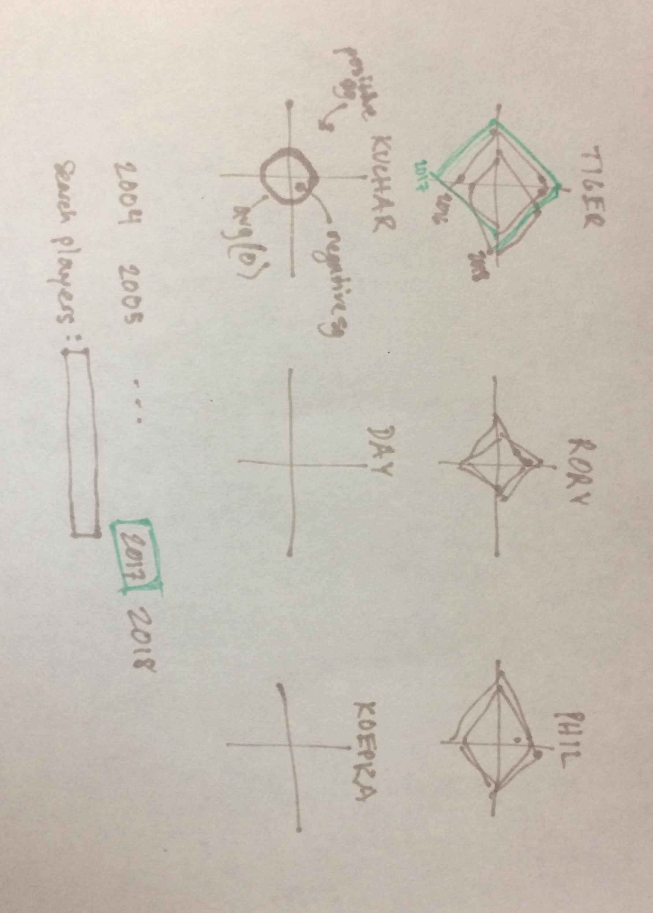

# pga-profiles

Using strokes gained data scraped from the PGA Tour's [statistics page](https://www.pgatour.com/stats/), I want to construct player profile radar/spider charts to compare players across seasons.

I made a rough sketch of my idea outlining some of my desired features (highlighting/animating to show differences over time, ability to search for a particular player, etc.):

### Resources

Running list of tutorials & links I found helpful in the course of this project:

* Spider chart [tutorial](https://yangdanny97.github.io/blog/2019/03/01/D3-Spider-Chart) by Danny Yang

* Small multiples Observable [notebook](https://observablehq.com/@pstuffa/drought-maps) by Paul Buffa

* Small multiples [tutorial](https://bl.ocks.org/mbostock/9490313) by Mike Bostock

* Nesting [explanation](https://amber.rbind.io/2017/05/02/nesting/) by Amber Thomas

* Mouseover highlighting [example](http://bl.ocks.org/phil-pedruco/9032348)

* Absolute-positioned tooltip [block](https://bl.ocks.org/mbostock/1087001) by Mike Bostock
