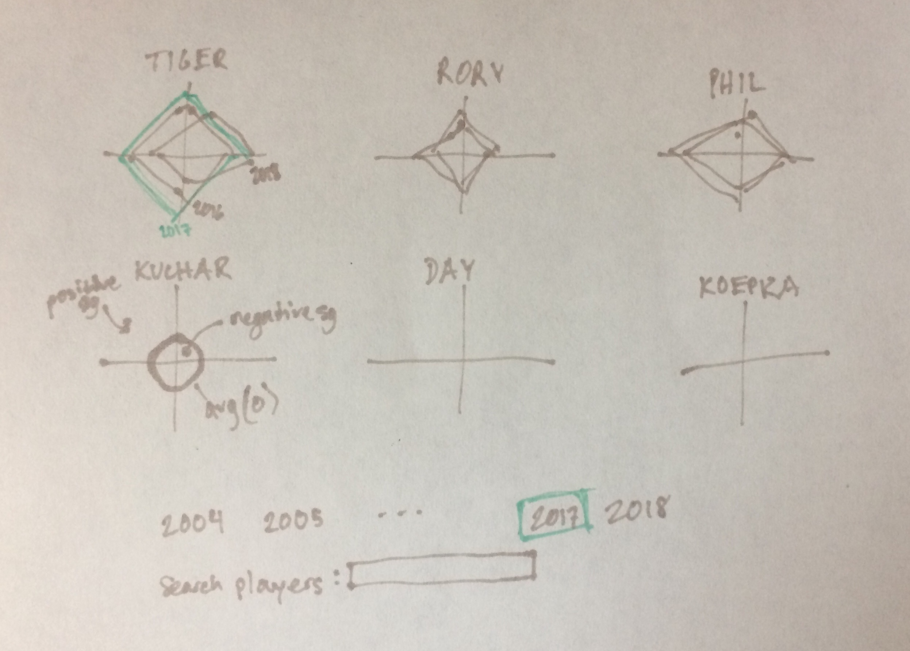

# pga-profiles

Using strokes gained data scraped from the PGA Tour's [statistics page](https://www.pgatour.com/stats/), I want to construct player profile radar/spider charts to compare players across seasons.

I made a rough sketch of my idea outlining some of my desired features (highlighting/animating to show differences over time, ability to search for a particular player, etc.):

